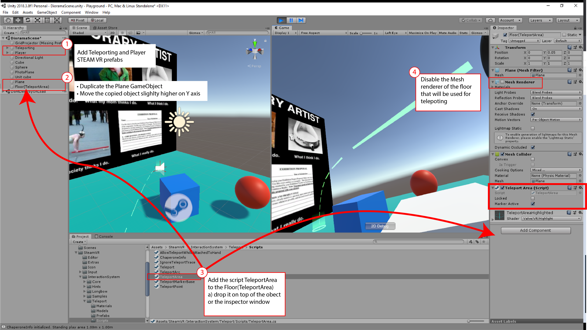

# VR-assignment3
Adding teleportation and some collision

## Using Scripts, Colliders and Basic Navigation
> Incremental work to **Assignment 2** repo

---
## Goals

In this assignment you will start with the github classroom link, modify your assignment2 repository, add a package to your Unity project, make modifications to the scripts and project, commit the changes, and push back the updated repository to github.

## Potential Resources
* Lynda.com
  * Unity 3D Essential Training
  * C# for Unity
  * Unity 2017: Architectural Visualization
* [Unity scripting reference](https://docs.unity3d.com/ScriptReference/)
  * [Transform.Rotate](https://docs.unity3d.com/ScriptReference/Transform.Rotate.html)
* [Collider](https://docs.unity3d.com/Manual/CollidersOverview.html)
* Rigidbody
* [Unity Answers](https://answers.unity.com/index.html)

Fisrt Person Character Falls Through Floor
Basic Teleporting STEAMVR

## Learning Outcomes

In this project, you will learn about using scripts, colliders and implement basic navigation in Unity.
* Adding a script to a game object
* Importing packages into Assets folder
* Add teleporting to the scene

---
> NOTE: this assignment is an addition to your repo assignment2 at the end of the assignment, you will update your repo called assignemnt2

## Directions

1. Download the package assignment3.unitypackage into your downloads folder
1. In Unity, make sure are working from your project called **assignment2-yourName**
1. Import the assignment3.unitypackage by double clicking it and accepting the import options
1. Make a new scene and call it VR-diorama (or import your current diorama as a package)
    1. Place your diorama scene in */Assets/Assignment3/Scenes/*
1. Add the script */Assets/Assignment3/Scipts/* **Spin.cs** to a cube GameObject that you created for your diorama (if you don't have a cube, create a new one)
1. Modify the rotation speed */Assets/Assignment3/Scipts/Spin.cs* to make the cube spin at rate of 30 revolutions per minute.
1. Add a Box Collider to the cube so user and objects don't go through it.
1 .Add a Rigidbody component to the sphere. If tyou don't have a spehre, create a new one.
1. Add a Sphere Collider to the sphere.

### Teleporting STEAMVR
1. Import Steam VR Plugin into your project (From the Unity asset store)
1. Implement navigation with teleport using Steam VR plugin
1. Delete the main camera game object from the Hierarchy panel
> *test that your navigation works

### Prepare to submit
> You will submit changes from the GitHub repo created for assignment2
1. Take a screenshot of a)Scene view and b)Game view in action (while the play button is active)
1. Add screenshots to the */Assets/Assignment3/Screenshots* folder
1. Commit changes to repository, remember to add a useful commit message. (Summary: Assignmet 3, Description: What you did)
1. Push committed changes to GitHub.

### Bonus point
* Make a new script to Rotate other objects at on different axis
* Commit changes to repository, remember to add a useful commit message. (Summary: Added textures and added rotation to object1, object34, etc.)
* Push committed changes to GitHub.

> NOTE: For this assignment you should add the unity package to your repo called assignment2-youName, and commit these changes in from that GitHub repository.
